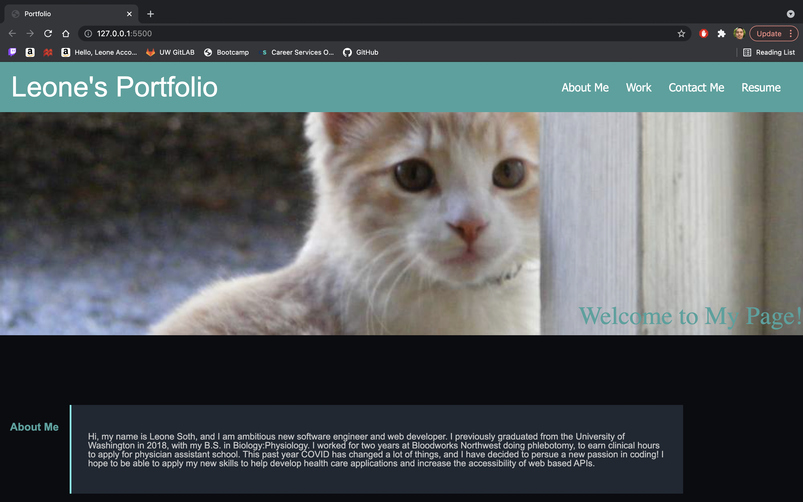
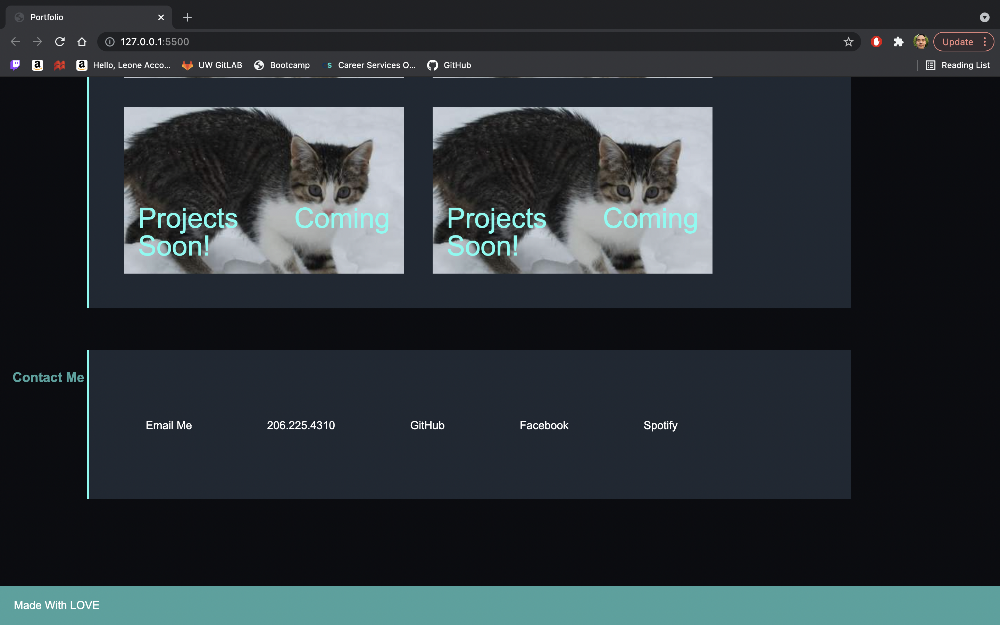

# Professional Portfolio

## Description

For this project the goal was to create a responsive porfolio page with responsive links, to direct you to different parts of the pages, as well as working links for contact information. Also there should be links t odifferent completed work done by the creator of the website. Also when the screen changes size so does the layout of the page. 

## Installation

To open the project just visit this url: https://lsoth.github.io/02profport/

## Usage

Here are some examples of what the website looks like, the links in the header of the page
all work to take you to the different sections of the page. 

## Credits

In order to help accomplish my goals, I referenced a few different websites and information from class and previous homework.
The websites include: 

https://www.w3schools.com/css/default.asp

https://developer.mozilla.org/en-US/docs/Web/CSS/box-shadow

https://yoksel.github.io/flex-cheatsheet/

## Licence

no licence
